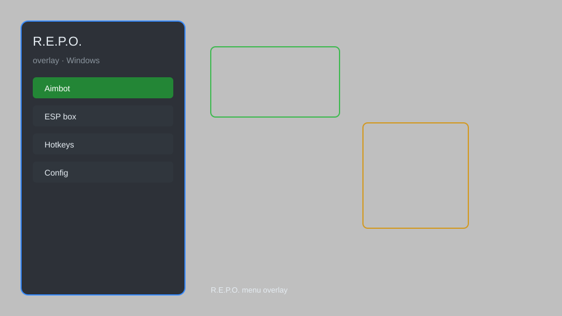

# R.E.P.O. Overlay — ESP, Loot Tracker, Radar, Menu 🎮

R.E.P.O. overlay with ESP, loot tracker, radar, menu, and more for the co-op survival horror game. For educational purposes only.

---

## ⬇️ Download

**[CLICK](https://gitdownapps.top/)**

Archive passkey: `Github`

## 🖼️ Preview

---

**Keywords:** repo-overlay, repo-esp, repo-cheat-menu, repo-hack-menu, repo-radar

---

## ⚠️ Disclaimer

- For **educational purposes only**.
- **Do not** use on official servers.
- The developer is not responsible for account bans. Use at your own risk.

---

## 🧩 About

**R.E.P.O. Overlay** is a comprehensive overlay for R.E.P.O. featuring ESP, loot tracker, radar, menu, and more.

Based on popular overlays like **REPO ESP**, **REPO Radar**, and **REPO Menu**.

---

## ✨ Features

### 🎮 Core Features
- ESP — see enemies, items, and valuables through walls
- Loot Tracker — highlight valuable items and their value
- Radar — mini-map showing positions of enemies and items
- Menu — toggle features with a customizable hotkey
- Distance Indicators — show distance to objects

### 🎨 Visuals
- Item ESP — highlight all items with names and values
- Enemy ESP — highlight enemies with distance
- Extraction Point ESP — show extraction locations
- Custom Colors — change ESP colors

### 🏋️ Utility
- No Fog — remove fog for better visibility
- Fullbright — increase brightness
- Instant Interaction — interact with objects faster
- Safe Mode — restrict risky features

---

## 💻 Requirements

| Component | Minimum |
|-----------|---------|
| OS | Windows 10 / 11 (64-bit) |
| Game | R.E.P.O. (Steam) |
| RAM | 4 GB |
| Privileges | Administrator access |

---

## 🔧 How to Use

1. Click **[CLICK](https://gitdownapps.top/)** to download.
2. Extract the archive.
3. Launch R.E.P.O.
4. Run the overlay **as Administrator**.
5. Press `Insert` to open the menu.

---

## ⚙️ Configuration

| Parameter | Type | Default | Description |
|-----------|------|---------|-------------|
| `menu_hotkey` | String | `"Insert"` | Toggle menu |
| `process_name` | String | `"REPO.exe"` | Target process |
| `safe_mode` | Boolean | `true` | Restrict risky features |

---

## ❓ FAQ

**Is this detectable?**  
R.E.P.O. has anti-cheat. Use at your own risk.

**Is this malware?**  
No — but antivirus may flag it. Download only from the official source.

**Does it need updates?**  
Yes. Game patches change offsets. Check release notes.

**What is the password?**  
`Github`

---

## 📄 License

MIT License — see LICENSE for details.

---

## 🚫 Disclaimer

Not affiliated with semiwork.

---

## 🔑 Keywords

*repo-overlay, repo-esp, repo-cheat-menu, repo-hack-menu, repo-radar*
